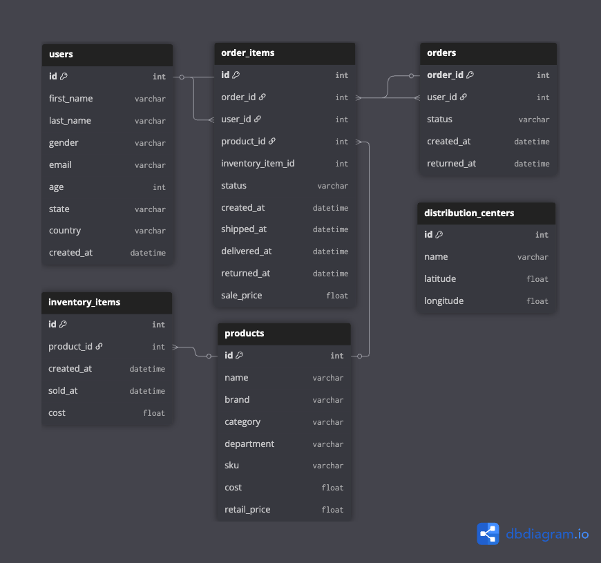

# Sales & Customer Performance Dashboard
*SQL (BigQuery) + Tableau Public*

## 📌 Project Objective
To analyze sales and customer data from a simulated-ecommerce platform using SQL and visualize business insights in Tableau. The objective is to identify sales trends, product performance, and customer behavior across regions and time periods to support business decision-making.

## 📊 Tools Used
- **Google BigQuery (Sandbox)** - SQL queries & data extraction
- **Tableau Public** - Dashboard creation & visual storytelling
- **GitHub** - Version control and project sharing
- **Google Docs / Word** - Insight summary and reporting

## 🧠 Dataset
This project uses the public BigQuery dataset:
**`bigquery-public-data.thelook_ecommerce`**

Key tables:
- `users` - customer profiles
- `orders` - purchase transactions
- `order_items` - products in each order
- `products` - item details like category, brand, cost
- `distribution_centers` - (optional) for regional insights

## 🗺️ Entity Relationship Diagram (ERD)
Visualizing the structure and table relationships of the `bigquery-public-data.thelook_ecommerce` dataset. It serves as the foundation for designing efficient SQL queries and meaningful dashboard insights.

📎 [Download full ERD in PDF format](./screenshots/erd_thelook_ecommerce.pdf)

---

*More sections will be added as the project progresses.*
